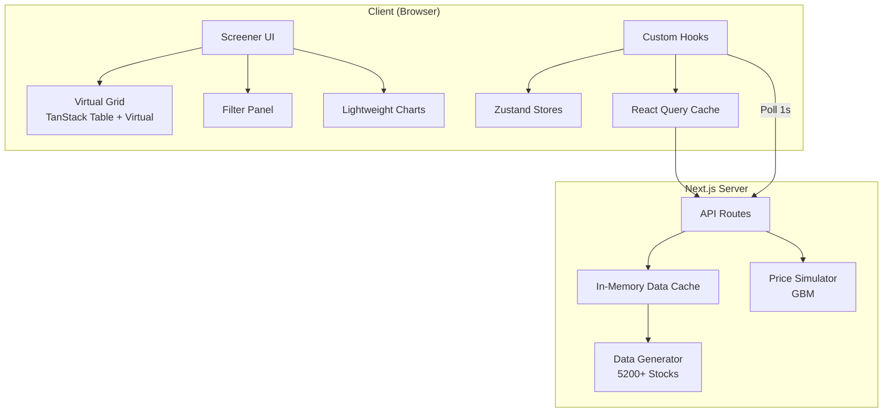

# Architecture Documentation

## Overview

StockScreener is a production-grade real-time stock screener built with Next.js 14 App Router, handling 5,200+ stocks with sub-200ms filtering, virtual scrolling, and simulated WebSocket price updates.

## Architecture Diagram



## Data Flow

### Filter Pipeline
1. **Parse** — Filter rules → AST (AND composition)
2. **Optimize** — Reorder predicates by selectivity (short-circuit)
3. **Execute** — Compiled predicate functions over stock array
4. **Sort** — Stable sort with original index tiebreaker
5. **Virtualize** — TanStack Virtual renders visible rows only

### Real-Time Updates
1. Client polls `/api/prices/updates` every 1s
2. Server generates 50 GBM price updates per batch
3. Updates queued in Zustand `pendingUpdates`
4. `requestAnimationFrame` batches flush to `prices` map
5. Only affected grid cells re-render with flash animation

## Folder Structure

```
src/
├── app/
│   ├── (screener)/          # Route group
│   │   ├── layout.tsx
│   │   ├── page.tsx         # Main screener
│   │   └── watchlist/
│   ├── stock/[symbol]/      # Stock detail page
│   ├── api/                 # Mock API routes
│   └── providers.tsx
├── components/
│   ├── charts/              # Lightweight Charts
│   ├── filters/             # Filter panel
│   ├── grid/                # Virtual data grid
│   ├── layout/              # Header, detail panel
│   └── screener/            # Main screener view
├── hooks/
│   ├── useStockData.ts      # React Query hooks
│   ├── useFilterEngine.ts   # Filter + sort pipeline
│   └── useWebSocket.ts      # Real-time polling + RAF
├── lib/
│   ├── data/                # Generation + cache
│   ├── filter-engine/       # AST parser, optimizer, executor
│   ├── indicators/          # SMA, EMA, RSI, MACD, etc.
│   ├── websocket/           # GBM simulator
│   └── api/                 # Response helpers
├── stores/                  # Zustand stores
└── types/                   # TypeScript definitions
```

## State Management

| Store | Purpose |
|-------|---------|
| React Query | Stock universe, history, fundamentals, presets |
| Filter Store | Rules, sort, search query |
| UI Store | Selected stock, panels, columns, high contrast |
| Watchlist Store | User watchlist symbols |
| Realtime Store | Live prices, WebSocket status, flash directions |

## Patterns Used

- **Compound Components** — Grid (header + virtual rows + cells)
- **Custom Hooks** — Data fetching, filtering, WebSocket
- **React Suspense** — Screener loading boundaries
- **Error Boundaries** — Graceful error recovery
- **Memoization** — `memo()` on grid rows, `useMemo` on filter results
- **Server Components** — Layouts where possible
- **Client Components** — Interactive screener, grid, charts

## Performance Optimizations

- Virtual scrolling (overscan: 12 rows, fixed height: 36px)
- Predicate compilation with WeakMap cache
- Short-circuit AND evaluation (cheapest predicates first)
- RAF-batched WebSocket updates
- Selective cell re-renders via Zustand selectors
- In-memory server-side data cache (singleton)
